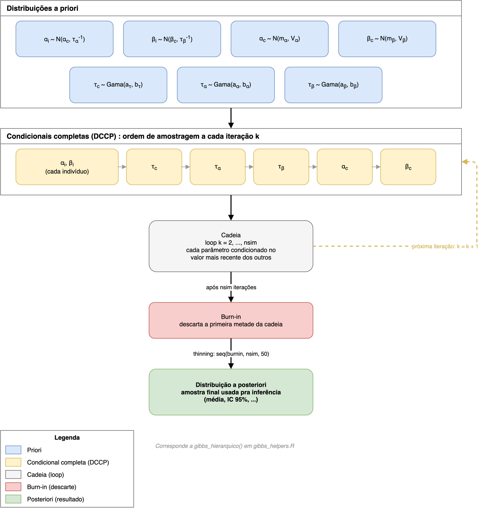
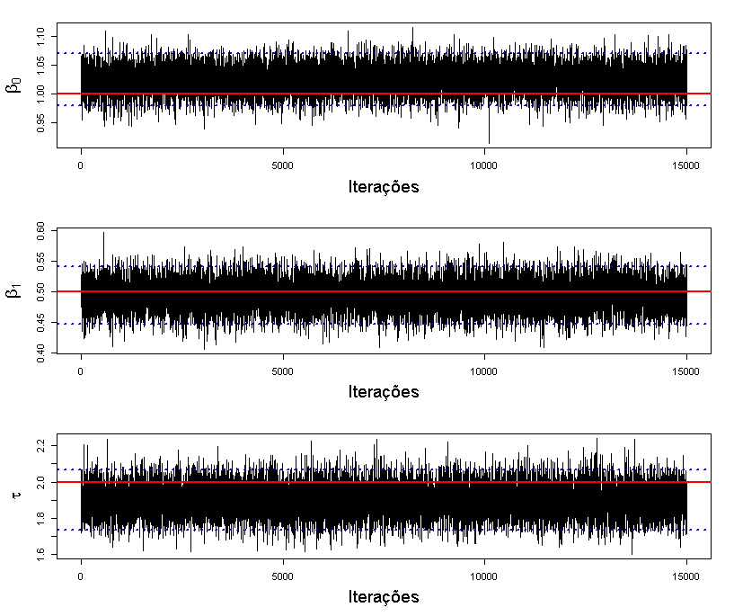
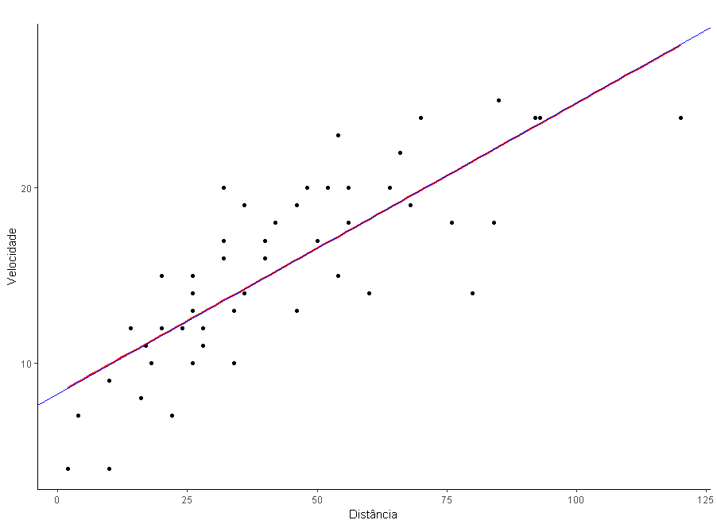
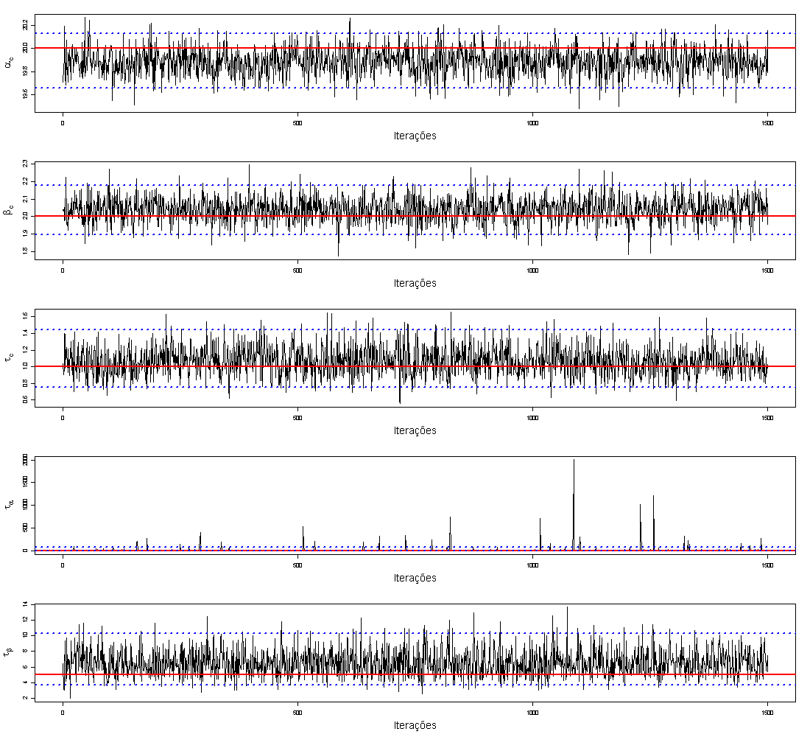
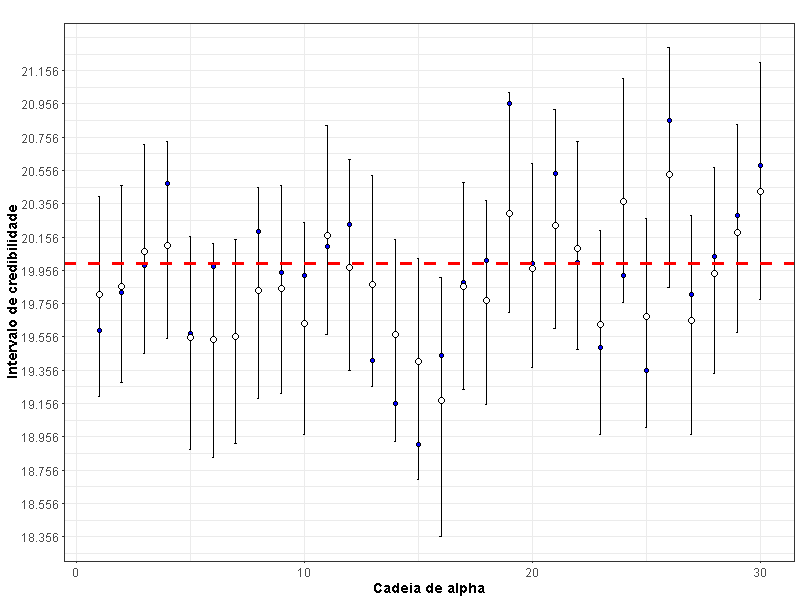

# Modelos lineares hierárquicos bayesianos

Amostrador de Gibbs implementado à mão em R, sem pacote pronto de MCMC, pra um modelo de regressão linear simples e pra um modelo linear hierárquico de 2 níveis.

## Contexto e motivação

Este projeto é a continuação de uma iniciação científica anterior. Na primeira, no 6º período da graduação em Estatística, o objetivo era calcular e apresentar estatísticas descritivas pra uma pesquisadora. Depois da análise exploratória, notei, junto com o orientador, que dava pra aprofundar a abordagem estatística.

Essa segunda iniciação começou com um objetivo direto: me preparar pra usar um modelo linear hierárquico bayesiano sobre os dados da mesma pesquisadora. Esse modelo foi aplicado depois na monografia "Uma aplicação de modelo hierárquico bayesiano na modelagem da dor em recém-nascidos submetidos à punção de calcâneo". O projeto rodou a partir de setembro de 2017, orientado pela professora Patrícia, com reuniões semanais pra acompanhar a metodologia e o andamento dos códigos.

Como objetivo secundário, antes do modelo hierárquico entrar em cena, faltava revisar regressão linear simples nos dois paradigmas (clássico e bayesiano) e implementar o amostrador de Gibbs à mão.

## Fundamentação teórica

Inferência estatística tem duas escolas principais. A clássica trata parâmetros como quantidades fixas e estima via função de verossimilhança. A bayesiana atribui uma distribuição a priori aos parâmetros desconhecidos, combina com a verossimilhança e obtém a distribuição a posteriori, proporcional ao produto das duas.

Com mais de um parâmetro desconhecido, a posteriori conjunta raramente tem forma fechada. A saída é MCMC: gerar uma cadeia de Markov cuja distribuição estacionária é a posteriori de interesse. O amostrador de Gibbs, proposto por Geman e Geman (1984) e popularizado por Gelfand e Smith (1990), amostra cada parâmetro condicionado no valor mais recente dos outros, a chamada distribuição condicional completa a posteriori (DCCP). Depois de um período de aquecimento (burn-in), a cadeia converge pra distribuição alvo.

Dois modelos estão implementados aqui. O simples,

$$Y_i \sim N(\beta_0 + \beta_1 X_i,\ \tau^{-1})$$

com priori Normal-Normal-Gama pra $(\beta_0, \beta_1, \tau)$, roda em dado simulado e no dataset `cars`. O hierárquico tem 2 níveis,

$$Y_{i,j} \sim N(\alpha_i + \beta_i x_j,\ \tau_c^{-1})$$

com $\alpha_i, \beta_i$ vindo de uma priori populacional $(\alpha_c, \beta_c)$, e roda em dado simulado e no `rats.txt` (peso de 30 ratos medido em 5 dias).

O fluxo do amostrador hierárquico, da priori até a posteriori:



As DCCPs de cada modelo, fechadas por conjugação Normal-Normal e Normal-Gama, estão derivadas passo a passo em [`artigo.pdf`](artigo.pdf). Uma versão resumida, ao lado do código e do gráfico, está em [`modelo_simples.qmd`](modelo_simples.qmd) e [`modelo_hierarquico.qmd`](modelo_hierarquico.qmd).

## Como rodar

Requer R. Pra renderizar os `.qmd` também precisa do [Quarto CLI](https://quarto.org/docs/get-started/); os scripts `.R` rodam sem ele.

```r
# na raiz do repo, no console do R:
renv::restore()  # instala as versões de pacote travadas em renv.lock
```

- `Rscript modelo_simples.R` roda o modelo simples de ponta a ponta (dado simulado + `cars`).
- `Rscript modelo_hierarquico.R` roda o hierárquico (dado simulado + `rats.txt`; nsim=150000 leva uns 30s numa máquina comum).
- `quarto render modelo_simples.qmd` e `quarto render modelo_hierarquico.qmd` geram os HTMLs com matemática, código e gráfico juntos.

`gibbs_helpers.R` reúne as funções de diagnóstico (traceplot, ACF, sumário de coeficientes) usadas pelos dois modelos. É também o arquivo carregado ao vivo, via `source()`, por um post do blog, então o nome e o path dele na branch `master` são estáveis de propósito.

## Resultados

### Modelo simples



Com priori pouco informativa, a média posteriori recupera os parâmetros usados pra simular os dados (β0=1, β1=0,5, τ=2).



No dataset `cars`, a reta bayesiana e a reta de mínimos quadrados praticamente coincidem, esperado com priori não informativa e n=50.

### Modelo hierárquico





Os 30 $\alpha_i$ individuais ficam espalhados em torno de $\alpha_c=20$ (linha tracejada), e o intervalo de credibilidade de 95% cobre o valor real usado na simulação pra praticamente todos.

Resultado completo, com todos os gráficos e as tabelas de coeficiente, em [`modelo_simples.qmd`](modelo_simples.qmd) e [`modelo_hierarquico.qmd`](modelo_hierarquico.qmd).

## Referências bibliográficas

Links de livro pra Amazon são de afiliado (`tag=gomesfellipe-20`), mesmo padrão usado no [post do blog](https://gomesfellipe.github.io/post/2018-07-28-modelo-bayesiano-do-zero/).

Banerjee, S., Gelfand, A. E. e Carlin, B. P. (2003) <a href="https://www.amazon.com.br/Hierarchical-Modeling-Analysis-Spatial-Data/dp/158488410X?tag=gomesfellipe-20" target="_blank" rel="sponsored nofollow noopener"><em>Hierarchical Modeling and Analysis for Spatial Data</em></a>. Chapman & Hall/CRC.

Gamerman, D. e Lopes, H. F. (2006) <a href="https://www.amazon.com.br/Markov-Chain-Monte-Carlo-Statistical/dp/1584885874?tag=gomesfellipe-20" target="_blank" rel="sponsored nofollow noopener"><em>Monte Carlo Markov Chain: Stochastic Simulation for Bayesian Inference</em></a>. London: Chapman & Hall, second edn.

Gelman, A. e Hill, J. (2006) <a href="https://www.amazon.com.br/Analysis-Regression-Multilevel-Hierarchical-Models/dp/052168689X?tag=gomesfellipe-20" target="_blank" rel="sponsored nofollow noopener"><em>Data Analysis Using Regression and Multilevel/Hierarchical Models</em></a>. Cambridge University Press.

Raudenbush, S. W., Bryk, A. S. (2001) <a href="https://www.amazon.com.br/Hierarchical-Linear-Models-Applications-Analysis/dp/076191904X?tag=gomesfellipe-20" target="_blank" rel="sponsored nofollow noopener"><em>Hierarchical linear models: applications and data analysis methods</em></a>. Sage.

Souza, R. de O. *Modelagem do nível de dor e estresse de recém-nascidos internados em UTI neonatal utilizando um modelo hierárquico Bayesiano com dados longitudinais*. Universidade Federal Fluminense, RJ, Brasil: Trabalho de Conclusão de Curso, Bacharelado em Estatística, 2015.

Velarde, L. G. C., Migon, H. S., Alcoforado, D. A. Hierarchical Bayesian models applied to air surveillance radars. *European Journal of Operational Research*, v. 184, p. 1155-1162, 2008.
